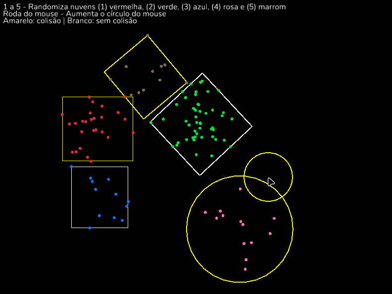
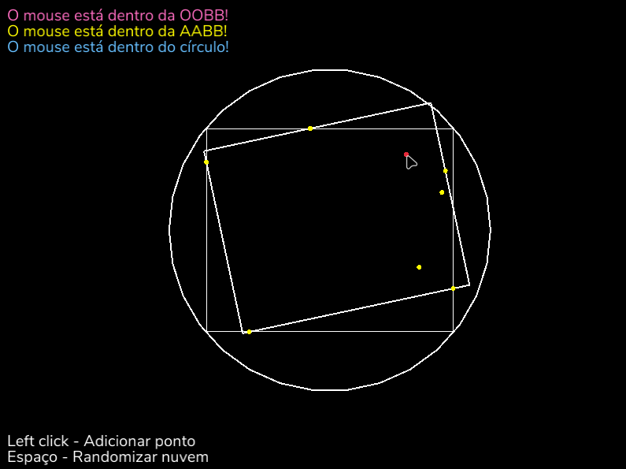

# Jufi - Biblioteca de física da Júlia
Biblioteca de testes de física 2D criada como trabalho final da cadeira de matemática e física para jogos.

Features:
- Simulação de partículas / colisão de partículas com linhas
- Checks de pertencimento de ponto a AABBs, OOBBs, e Círculos.
- Checks de sobreposição entre AABBs, OOBBs e Círculos.
  - AABBs e OOBBs via SAT (Separating Axis Theorem).
  - Círculos e outros via projeção para espaço local + check vs. AABB
- Geradores radiais e "em caixa" de nuvens de pontos
- Geração de AABBs, OOBBs, e Círculos que englobam nuvem de pontos

# Exemplos
### collision
Testes de colisão entre bounding boxes e círculos \
`cargo run --example collision` \

### points
Testes com pontos, nuvens de pontos, e geração de bounding boxes/círculos envoltórios. \
`cargo run --example points` \
